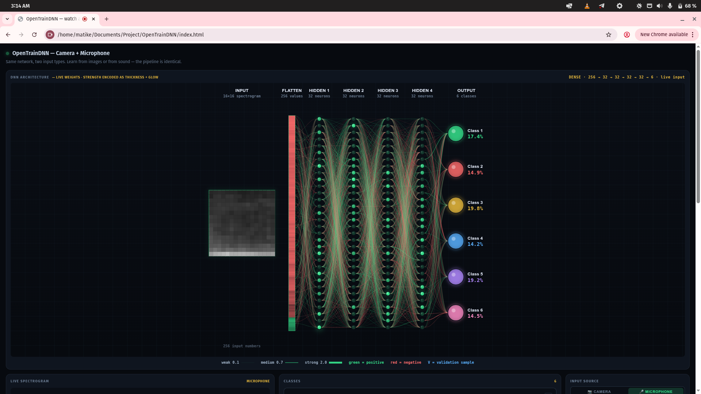

# OpenTrainDNN

**Watch a neural network learn — in your browser.**

Open one HTML file. Point your camera or microphone at two things.
Capture twenty samples of each. Press **Train**.
Every neuron, every weight, every activation updates on screen in real time.



**No install. No build step. No framework. No backend.**


> **A note on the name.** This project is unrelated to OpenTrain AI (a data-labeling marketplace) and to Intel oneDNN (a deep-learning performance library). Same words, entirely different projects.


## Table of contents

- [Why this exists](#why-this-exists)
- [Features](#features)
- [Quick start](#quick-start)
- [What it can and cannot learn](#what-it-can-and-cannot-learn)
- [Project structure](#project-structure)
- [How it works](#how-it-works)
- [What it demonstrates](#what-it-demonstrates)
- [Requirements](#requirements)
- [Contributing](#contributing)
- [Security](#security)
- [License](#license)


## Why this exists

Every machine learning framework hides the interesting part behind a single function call. You write `model.fit(x, y)` and a number goes down. You never see what happened.

OpenTrainDNN does not hide anything. It runs a real neural network — real backpropagation, real optimizer, real weight updates — entirely in your browser. Every layer is visible. Every weight is a wire you can watch move. Every activation is on screen at the moment it is computed.

It exists to answer one question: **what does a neural network actually do?**

It is a teaching tool, not a framework. If you want to build production models, use PyTorch or JAX. If you want to see what those models are actually doing, use this.


## Features

### Two input types, one network

The camera turns each frame into a 16×16 grayscale image. The microphone turns each sound into a 16×16 mel spectrogram. Both produce 256 numbers in the range −1 to +1. The network does not know the difference. That is the point.

### Two architectures

- **Dense** — fully connected, small, fast, easy to reason about.
- **CNN** — convolutional, learns spatial filters, shows you the feature maps as they form.

### Twelve resolutions

From 4×4 to 64×64. Small resolutions train in seconds. Large resolutions require more data. The tool makes the trade-off visible.

### Everything is on screen

- Every neuron is a glowing circle whose brightness tracks its activation.
- Every weight is a curved wire whose thickness, brightness, and glow track its magnitude.
- Every feature map updates every frame.
- The input itself — image or spectrogram — is shown full-size.

### Honest training

- **Exact analytical gradients.** No finite differences anywhere.
- **Adam optimizer.** Same update rule as production frameworks.
- **Gradient clipping.** Prevents divergence on large networks.
- **Train / validation split.** Every fifth sample is held out.
- **Live overfitting warning.** Fires the moment validation accuracy falls behind its peak.

### Persistence

Save the trained weights as JSON. Load them back later. Class names and colors survive the reload.


## Quick start

### 1. Open it

Download the repository. Open `index.html` in any modern browser.

Prefer to serve it? Run a local server from the project folder:

`python3 -m http.server 8000`

Then open `http://localhost:8000/`.

You can also use the live version hosted on GitHub Pages:

`https://MatiwosKebede.github.io/OpenTrainDNN/`

### 2. Train your first network

1. Click **Start camera**. Allow the permission prompt.
2. Hold a **red object** in front of the camera. Press <kbd>1</kbd> fifteen times while moving it slightly.
3. Hold a **blue object**. Press <kbd>2</kbd> fifteen times, same motion.
4. Press **Train**.
5. Watch the DNN preview fill in. Wires thicken and glow. After about ten seconds, accuracy stops rising.
6. Alternate the two objects. The prediction box flips.

### 3. Try the microphone

1. Switch the input source to **🎤 Microphone**.
2. Say **"yes"** twenty times. Press <kbd>1</kbd> after each.
3. Say **"no"** twenty times. Press <kbd>2</kbd> after each.
4. Press **Train**.
5. Say "yes". The first bar fills. Say "no". It flips.

That is the entire system end-to-end: **real signal → real numbers → real learning → real prediction**.


## What it can and cannot learn

| ✅ Works well | ⚠️ Works marginally | ❌ Does not work |
|---|---|---|
| Distinct colors | Pen vs pencil *(if the tip is visible)* | Fine textures (wood vs metal) |
| Distinct brightness | Letters A vs B *(not A vs Å)* | Small details |
| Faces (you vs a wall) | Two similar faces | Full sentences |
| Hand gestures | | Cat vs dog |
| Simple shapes | | Anything requiring counting |
| Two short words | | Anything requiring reasoning |

> **The rule.** If a person could tell two things apart from a small grayscale thumbnail, the network can learn to do the same. If not, it cannot. No amount of training will help.


## Project structure

```
OpenTrainDNN/
├── index.html          — markup
├── style.css           — styling
├── README.md           — this file
├── CONTRIBUTING.md     — how to contribute
├── CODE_OF_CONDUCT.md  — community standards
├── SECURITY.md         — disclosure policy
├── CHANGELOG.md        — version history
├── LICENSE             — MIT
├── docs/
│   └── screenshot.png  — README image
├── .github/
│   ├── ISSUE_TEMPLATE/ — bug and feature templates
│   ├── workflows/      — Pages deployment
│   └── PULL_REQUEST_TEMPLATE.md
└── js/
    ├── math.js         — pure helpers, activations, MOSFET model
    ├── state.js        — every mutable global
    ├── input.js        — image + audio pipelines
    ├── network.js      — dense + CNN forward/backward
    ├── visualize.js    — live view, DNN preview, feature maps
    ├── classes.js      — class UI, capture, file handling
    └── main.js         — boot, save/load, event wiring, main loop
```

**Load order matters.** The script tags in `index.html` must load in exactly this sequence:

```
math  →  state  →  input  →  network  →  visualize  →  classes  →  main
```

Each module depends only on the ones before it.


## How it works

### The input pipeline

Both input types are converted to a square grid of numbers in the range **−1 to +1**.

| Camera | Microphone |
|---|---|
| Frame drawn to offscreen canvas at SIZE×SIZE | `AnalyserNode` computes spectrum at 40 Hz |
| Read luminance of each pixel | Bin into log-spaced bands |
| Flatten to `Float64Array(SIZE²)` | Write column into ring buffer |
| | Flatten buffer to `Float64Array(SIZE²)` |

### The network

Standard feed-forward stack. Either:

`input → dense → dense → ... → output (softmax)`

or:

`input → conv → relu → pool → conv → relu → pool → flatten → dense → output`

### The training loop

Stochastic gradient descent with:

- **Mini-batch size:** 32 (Dense), 8 (CNN)
- **Optimizer:** Adam, β₁ = 0.9, β₂ = 0.999
- **Learning rate:** 0.01 (Dense), 0.008 (CNN)
- **Weight clip:** ±6
- **Gradients:** exact analytical derivatives

No finite differences. No autograd. Every derivative is written out by hand in `network.js`.


## What it demonstrates

| | Lesson |
|---|---|
| 🧠 | **Backpropagation is a coordinate transformation.** The hidden layers re-parameterize the input so the final classification becomes linear in the new coordinates. |
| 📈 | **Generalization is real.** A network trained on 40 samples answers correctly for points it has never seen. |
| 📉 | **Overfitting is real.** Training accuracy goes up while validation accuracy goes down. The warning fires the moment the gap opens. |
| 📊 | **Data determines learning.** One image per class produces a network that reports 100% accuracy and fails on everything else. Forty images per class produces a network that works. |
| 🔄 | **The medium does not matter.** The same learning rule works whether the input is light or sound, and whether the unit is a smooth activation or a MOSFET. |


## Requirements

Any modern browser with `getUserMedia` and Web Audio API support.

| Browser | Status |
|---|---|
| Chrome | ✅ Tested |
| Firefox | ✅ Tested |
| Safari | ✅ Tested |
| Edge | ✅ Tested |

No plugins. No extensions. No install.

The microphone requires **HTTPS** in some browsers. GitHub Pages provides that automatically. Locally, a small HTTP server such as Python's built-in one is enough.


## Contributing

Contributions are welcome. See [CONTRIBUTING.md](CONTRIBUTING.md) for the full guide.

Short version:

- Keep the modular structure intact.
- Do not add new architectures (RNN, LSTM, Transformer, attention).
- Do not add a build step or dependencies.
- Test on at least two browsers.
- Bug reports and honest criticism are more valuable than features.


## Security

See [SECURITY.md](SECURITY.md) for the disclosure policy.


## License

MIT. See [LICENSE](LICENSE) for the full text.


** Developed by Matiwos Kebede**

*The same learning algorithm runs in a browser tab and in a data center.*
*The difference is only scale.*
